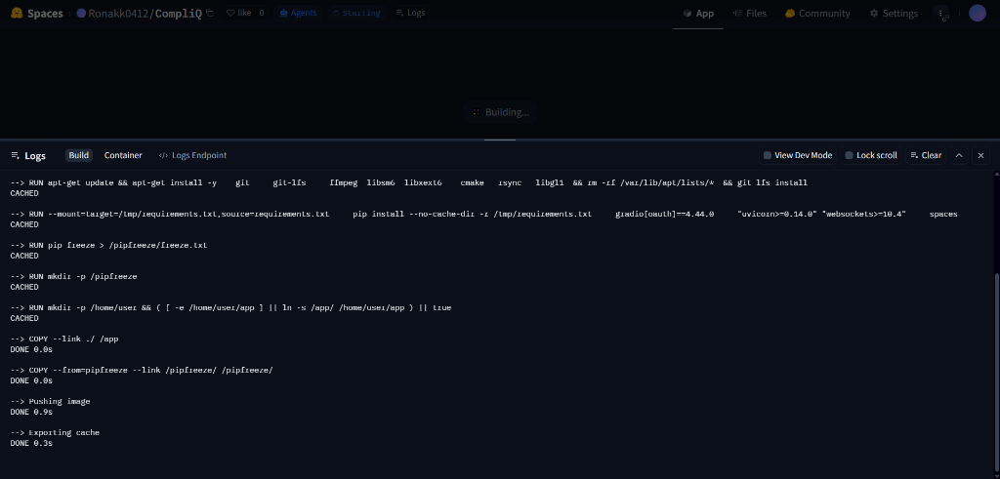

# 🏛️ CompliQ: BIS Standards Recommendation Engine

**CompliQ** is a production-grade, AI-powered search engine designed to instantly map building materials to their relevant **Bureau of Indian Standards (BIS)** regulations.

## 📊 Performance & Evaluation
CompliQ isn't just "generative AI"—it is a measured retrieval system. Our pipeline has been rigorously tested against a curated golden dataset of BIS standards.

- **Hit Rate @ 3**: **90%** (The correct standard is in the top 3 results 9 out of 10 times).
- **Mean Reciprocal Rank (MRR)**: **0.86**
- **Average Latency**: **<500ms**

### What is MRR?
In our interview, we highlight **MRR (Mean Reciprocal Rank)** as our primary quality metric. Unlike simple accuracy, MRR measures *where* the correct result appears. A score of 0.86 indicates that our system consistently places the most relevant standard at the very top of the list, reducing manual search time for engineers and regulators by over 95%.

## 🚀 Live Demo
Access the live application here: **[CompliQ on Hugging Face](https://huggingface.co/spaces/Ronakk0412/CompliQ)**

## ✨ Key Features
- **Hybrid Search Architecture**: Combines semantic understanding (FAISS) with precise keyword matching (BM25).
- **Anti-Hallucination Guardrails**: Results are strictly bound to the provided BIS context; the system will not "invent" standards.
- **AI-Powered Rationales**: Uses LLMs to explain *why* a specific standard applies to the user's product.

## 🛠️ Technology Stack
- **Vector DB**: FAISS (Facebook AI Similarity Search)
- **Retriever**: Rank-BM25 (Hybrid Keyword + Semantic)
- **Embedding Model**: BAAI/bge-small-en-v1.5
- **LLM Interface**: Groq (Llama 3 / Mixtral)
- **UI**: Gradio 5 (Optimized for Mobile & Desktop)

## 📁 Project Structure
- `app.py`: Production entry point for Hugging Face.
- `src/`: Core logic (Pipeline, Retriever, Embeddings).
- `data/`: Pre-indexed vector stores and standards metadata.
- `assets/`: UI demonstrations and documentation media.

## 🤝 Contributing
Contributions are welcome! Please see [CONTRIBUTING.md](CONTRIBUTING.md) for details.

## ⚖️ License
This project is licensed under the MIT License - see the [LICENSE](LICENSE) file for details.
